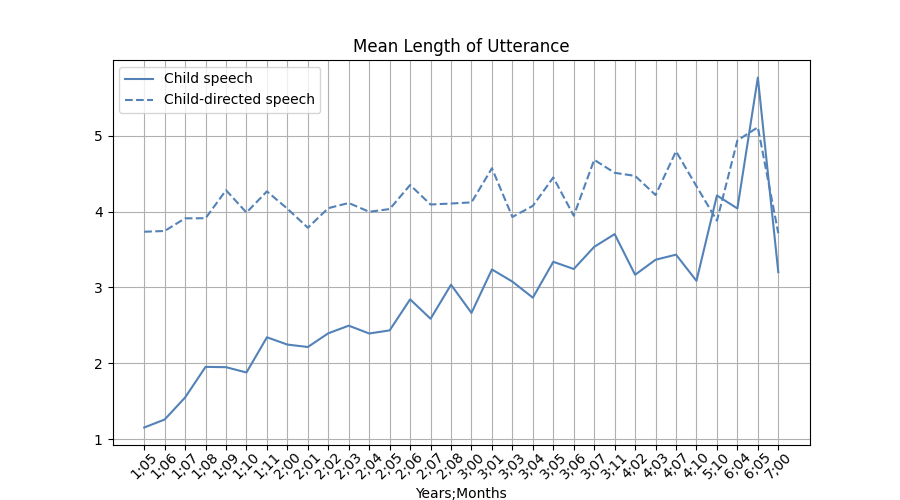
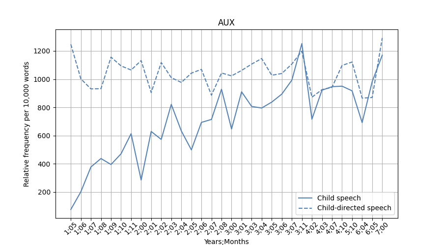
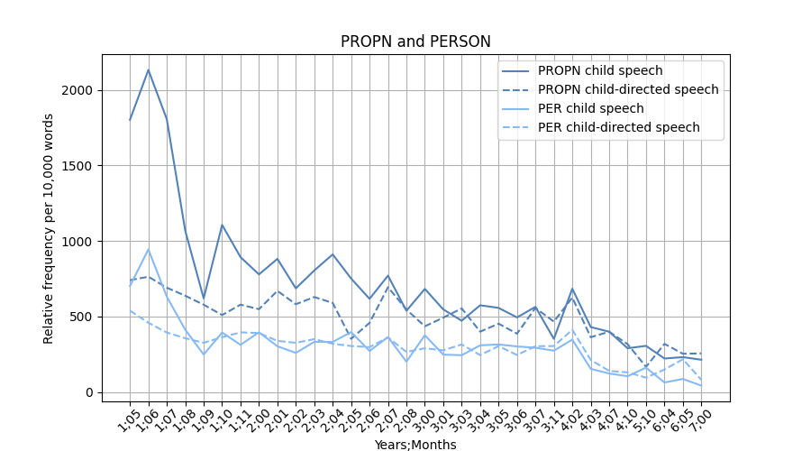

# language analytics assignment 5
This repository is assignment 5 out of 5, to be sumbitted for the exam of the university course [Language Analytics](https://kursuskatalog.au.dk/en/course/115693/Language-Analytics) at Aarhus Univeristy.

The task of this assignment is defined by the student. The following section describes the goal of the assignment. The __Solution__ section describes how the repository achieves the goal.

## Relative frequencies of different word classes in developing child speech and child-directed speech
The goal of this repository is to investigate childrens' use of selected word classes (aka. parts of speech) during the years of first-language acquisition as well as to track the equivalent for child-directed speech. Some related questions are: Which word classes does a child familiarize itself with faster? What is the learning trajectory and how does it differ among word classes? Does change in child-directed speech reflect the child's increasing langauge expertise?

## Solution
All code written for this assignment is within ``src``.  _The scripts assume that ``src`` is the working directory_. Here follows a description of the functionality of all the scripts in the folder.

- __preprocess.py__: The script fetches the transcripts of a user-defined corpus from the [CHILDES](https://sla.talkbank.org/TBB/childes) database - a database of transcribed child language - using the [Python API](https://github.com/TalkBank/TBDBpy) to TalkBankDB. The database path can be set from the terminal when running the script, e.g., ``python3 preprocess.py --corpus childes Eng-NA Braunwald`` which is the default corpus and the one visualised in the results section. The utterances of the transcripts are subjected to part-of-speech tagging and named entity recognition using ``spaCy``'s nlp pipeline [en_core_web_md](https://spacy.io/models/en#en_core_web_md). The script outputs a ``.csv`` in the ``data`` folder, indicating change in relative freqency per 10,000 words for selected word classes in both child speech and child-directed speech. The selected word classes are: ADJ (adjective), ADP (adposition), ADV (adverb), AUX (auxiliary), CCONJ (coordinating conjunction), NOUN, PRON (pronoun), PROPN (proper noun), SCONJ (subordinating conjunction), and VERB. See [Jurafsky & Martin (2023)](https://web.stanford.edu/~jurafsky/slp3/8.pdf) for definitions of word classes. Additionally, the relative frequency of named entities referring to people is also included, as well as the total amount of words spoken (_utterance\_len_) and the mean length of utterances (_mean\_utt\_len_). 

- __plot.py__: The script takes a user-defined dataset and a desired figure size as input. It produces plots showing relative frequency of a given word class for child speech and child-directed speech as the child ages. The relative frequency of names of people is plotted together with proper nouns. A plot showing change in mean length of utterance is also produced. The default terminal input is

    ```shell
    python3 plot.py --dataset Braunwald.csv --figsize 9 5
    ```

## Results
Here follows some observations based on the output produced by applying the scripts on the Braunwald corpus. This corpus was chosen as it spans over a long age range (1 and a half year to 7 years old) and because it is monolingual (the used ``spaCy`` pipeline is only trained for English). The corpus consists of 900 transcripts in which the child interacts with family members (mostly parents) during toyplay. Looking at the mean length of utterances (MLU), we clearly see a steady increase for the child. Interestingly, it seems that the MLU for child-directed speech also increases slighty, suggesting a dynamic in which the parents adapt the length of their utterances to the linguistic skill level of the child. At around the age of six years, the MLU for both types of speech are at the same level. Note, the x-axis is not a numeric scale - the number of months in between each tick varies.



The same dynamic is seen, although not as clearly, for the use of CCONJ and SCONJ. The relative frequency of these word classes increases for both types of speech (with a faster rate for child speech), which is to be expected since the frequency of these words inevitably must correlate with increasing lenght of utterance.

The child's learning trajectory differs among the word classes. The majority of the word classes is used less frequently by the child compared to non-child speakers during the first couple of years, before the child catches up. This is the case for ADP, AUX, CCONJ, PRON, and SCONJ - all being function words. Some clear examples of this type of trajectory are seen below.

<p float="left">
  
  
</p>
 

The opposite trend is seen in the case of nouns and proper nouns. Here, the word class frequency in child speech is greater than in child-directed speech before they align at around 3 years of age. An explanation could be that nouns are more easily learned since they are representations of - in many cases - objects that can be experienced in the world. For proper nouns, it is seen that person names make out about 50% of the proper nouns used by the child across all ages whild that percentage is generally even higher for child-directed speech. The relative frequencies for both person names and proper nouns in general seem to decrease with age.

<p float="left">
  
  
</p>

For the rest of the word classes (ADJ, ADV, and VERB) there is not a clear trend of child speech slowly aligning with child-directed speech. Rather, the relative frequency for both types of speech seem to be at similar levels across all ages.

This investigation has a few limitations. Note, that not all utterances from a non-child speaker may be child-directed, as they are coded as here. Sometimes the parents might be speaking to each other, to the recorder or to the older sister of the target child. However, this is only the case for a small number of the utterances. The age of the sister is not recorded in the meta data of the corpus. Judging from the recordings she might initially be less than 10 years old. In this investigation her utterances are included and coded as "child-directed speech", but considerations should be made whether this is appropriate if the sister is a child herself. Lastly, this investiagtion is only based on one child, thus, generalizations are not appropriate. However, the repository lents itself to expanding the investigation by being applicable to other corpora in the CHILDES database. 

## Setup
The scripts require the following to be run from the terminal:

```shell
bash setup.sh
```

This will create a virtual environment, ```assignment5_env``` (git ignored), to which the packages listed in ```requirements.txt``` will be downloaded. __Note__, ```setup.sh``` works only on computers running POSIX. Remember to activate the environment running the following line in a terminal before changing the working directory to ```src``` and running the scripts.

```shell 
source ./assignment5_env/bin/activate
```
